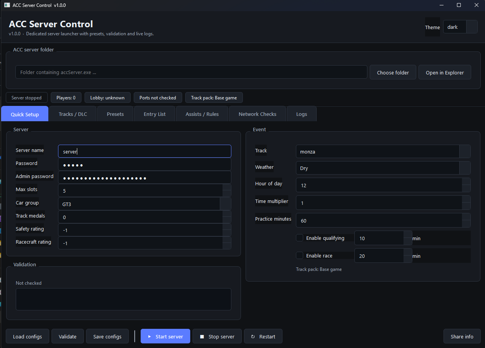

# ACC Dedicated Server Launcher

A clean, dark-themed GUI launcher for the **Assetto Corsa Competizione Dedicated Server** on Windows.

No more hand-editing JSON files. Configure your server, manage presets, watch live logs, and check network status — all from one window.



---

## Features

- **Quick Setup** — server name, passwords, slots, car group, track, weather, sessions (P/Q/R) in one place
- **Presets** — save and load full server snapshots (includes starter presets)
- **Entry List** — optional driver whitelist with Steam IDs, car models, ballast, restrictor
- **Assists & Rules** — toggle all driving assists; set pit windows, stint limits, tyre sets
- **Tracks / DLC** — filter tracks by owned DLC packs; warns when a DLC track is selected
- **Network Checks** — local port check (netstat), Windows Firewall rule creation, IP copy for friends
- **Live Logs** — color-coded real-time server output with error/warning/connection filters
- **Validation** — catches config errors before saving (slot limits, port conflicts, rating requirements)
- **Backup** — automatic timestamped backups of config files before every save
- **Dark / Light theme** — toggleable at runtime, persisted across sessions
- **Keyboard shortcuts** — `F5` Start · `F6` Stop · `F7` Restart · `Ctrl+S` Save configs

---

## Requirements

- **Windows 10 / 11**
- **Assetto Corsa Competizione Dedicated Server** (free on Steam, App ID 1430110)
- Python 3.11+ (only if running from source)
- [PyQt6](https://pypi.org/project/PyQt6/) (only if running from source — the pre-built exe bundles it)

---

## Quick Start (pre-built .exe)

1. Download `ACCLauncher.exe` from the [Releases](../../releases) page.
2. Place it anywhere convenient (e.g. inside your `server/` folder or on your Desktop).
3. Run it. On first launch, click **Choose** to point it at the folder containing `accServer.exe`.
4. Fill in your server name and password, pick a track, then click **▶ Start server**.

> **Note:** If you have never run the dedicated server before, make sure `cfg/` folder exists inside the server directory. The launcher creates missing subdirectories automatically.

---

## Running from Source

```bash
git clone https://github.com/pokryshkindaniil/acc-server-launcher.git
cd acc-server-launcher
pip install PyQt6
python acc_launcher.py
```

---

## Building the .exe

The project uses [PyInstaller](https://pyinstaller.org/).

```bash
pip install pyinstaller PyQt6
pyinstaller ACCLauncher.spec
```

The output will be at `dist/ACCLauncher.exe` — a single-file, no-console executable (PyQt6 and all dependencies are bundled).

> The spec file sets `console=False` so no terminal window opens when you double-click the exe.

---

## File Structure

```
server/
├── acc_launcher.py          # Main source (all UI + logic, no external deps)
├── ACCLauncher.spec         # PyInstaller build configuration
├── acc_launcher_config.json # Auto-created: persists theme, server path, DLC ownership
├── acc_launcher_presets.json# Auto-created: saved server presets
├── cfg/                     # ACC server config files (managed by the launcher)
│   ├── settings.json
│   ├── event.json
│   ├── configuration.json
│   ├── assistRules.json
│   ├── eventRules.json
│   └── entrylist.json
├── log/                     # Server log output
├── results/                 # Race result files
└── backups/                 # Timestamped config backups
```

---

## Configuration Files

The launcher reads and writes these ACC JSON files automatically:

| File | Controls |
|---|---|
| `cfg/settings.json` | Server name, passwords, max slots, car group, rating requirements |
| `cfg/event.json` | Track, weather, sessions (practice / qualifying / race), time of day |
| `cfg/configuration.json` | UDP/TCP ports, lobby registration, LAN discovery |
| `cfg/assistRules.json` | Driving assist permissions (clutch, stability, lights, etc.) |
| `cfg/eventRules.json` | Pit windows, stint time, tyre sets, formation lap type |
| `cfg/entrylist.json` | Optional driver whitelist with Steam IDs |

---

## Tips

- **Max slots > 10** requires Track Medals ≥ 3 and Safety Rating ≥ 70 — the validator will remind you.
- **DLC tracks** — if a friend doesn't own the DLC, they can't join. Use base tracks (Monza, Spa, etc.) for mixed groups.
- **Ports** — default UDP 9231 / TCP 9232. Forward both in your router for public servers. Use the **Network Checks** tab to verify.
- **Presets** are stored in `acc_launcher_presets.json` next to the launcher exe/script and are not overwritten when you reinstall or update.
- **Logs** — switch to the Logs tab after starting the server. Green = lobby registered, blue = connections, red = errors.
- **Steam ID** for the entry list looks like `S76561198xxxxxxxxx` and can be found in the server log when a driver connects.

---

## Contributing

Pull requests welcome. The entire application is a single Python file (`acc_launcher.py`) with no external dependencies, making it easy to fork and modify.

1. Fork the repo
2. Create a branch: `git checkout -b my-feature`
3. Make your changes in `acc_launcher.py`
4. Test by running `python acc_launcher.py`
5. Open a pull request

The only external dependency is **PyQt6**. Please don't add more.

---

## License

MIT — see [LICENSE](LICENSE).

---

## Acknowledgements

Built for the ACC community. Not affiliated with Kunos Simulazioni or Steam.
